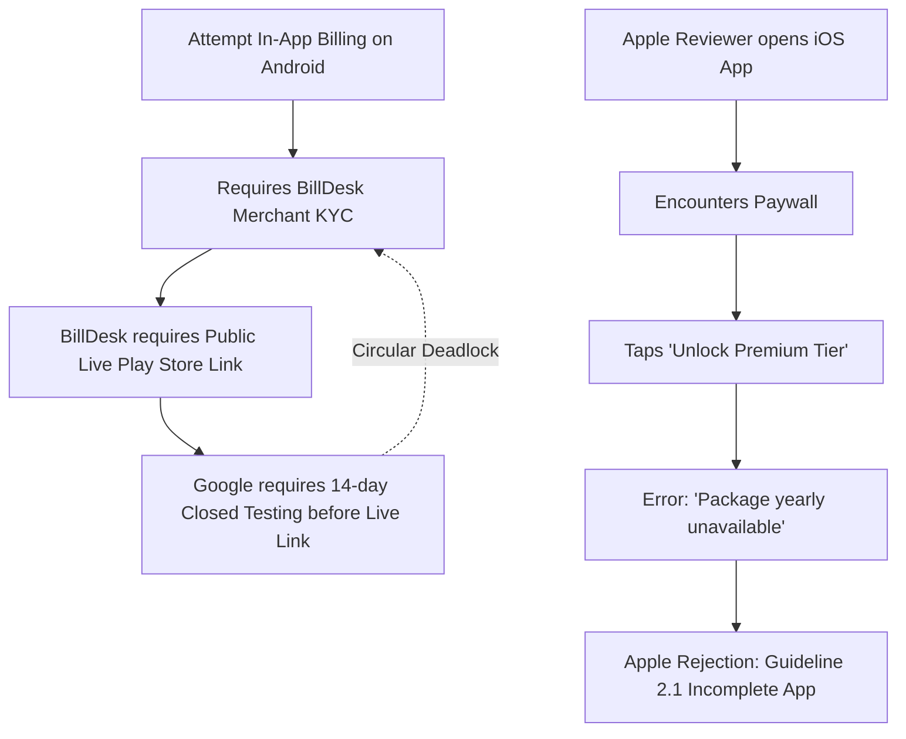

# Launch Strategy & Monetization Unblocking (v1.0 to v1.1)

**Date**: September 7, 2026  
**Document**: Launch Action Plan & Resolution Strategy  
**Status**: Active / Execution in Progress  

---

## 1. Executive Summary & Current State

### Android (Google Play Console)
- **Status**: Day 1 of mandatory 14-day Closed Testing track.
- **Blocker Encountered**: Google Play Payments Profile requires mandatory RBI/PA-CB Merchant Identity Verification handled via **BillDesk**.
- **The Issue**: BillDesk verification requires a **live, publicly accessible Google Play Store URL**. However, the app is currently in Closed Testing (`play.google.com/apps/testing/...`), which is restricted to authorized testers and throws an access/404 barrier to BillDesk review officers.

### iOS (Apple App Store Connect)
- **Status**: App version 1.0 (Build 2) **Rejected**.
- **Guideline**: `2.1.0 Performance: App Completeness`.
- **Reason**: Apple reviewers tapped **"Unlock Premium Tier"** on the paywall screen and encountered an inline red error:
  > *"Purchase failed: Package yearly unavailable"*
- Because core features (DSOP Simulator, Tax Planner, Wealth Optimization, Anomaly Detection) are gated behind this paywall, the reviewer was unable to test or verify the app's functionality and flagged the submission as incomplete.

---

## 2. Problem Statement: The Circular Dependency Loop

We are facing two interconnected blockers across both platforms:

1. **Android Loop**: BillDesk demands a live public URL before granting merchant payout approval. Google Play forbids public launch before completing 14-day closed testing.
2. **iOS Loop**: Apple rejects the app because the paywall is failing due to missing StoreKit product linkages and an unconfigured RevenueCat Apple App key.

---

## 3. What This Sprint Revealed

1. **Root Cause of iOS Paywall Failure**:
   - In [`RevenueCatApiKey.ios.kt`](file:///Users/sunil/Downloads/PayslipMAX%20KMP/shared/src/iosMain/kotlin/com/payslipmax/pdfparser/billing/RevenueCatApiKey.ios.kt), the app was compiled with the Phase 0 sandbox test key:
     `"test_QOmayJNDtTWprZuKRLJcsQKOOjW"`.
   - In RevenueCat's **API keys** settings, only two keys exist:
     - `Test Store`
     - `PayslipMax (Play Store)` (Google)
   - **There is NO Apple App Store configuration or `appl_...` key in RevenueCat yet.**
   - The StoreKit product was not linked in RevenueCat, so `resolveYearlyPackage()` returned `null`, triggering *"Package yearly unavailable"*.

2. **Root Cause of BillDesk Deadlock on Android**:
   - Online developer community consensus (`r/androiddev` and Google Developer policies) confirms: **Closed testing opt-in URLs (`/apps/testing/`) will ALWAYS be rejected by BillDesk**.
   - **Crucial Rule**: Free apps **DO NOT** require merchant verification to launch. A merchant account is only required when the app actively transacts real money payouts.

---

## 4. RevenueCat Process & Current State

From our audit of the RevenueCat dashboard:
* **Active Projects**: `PayslipMax`
* **Configured Apps**:
  - `Test Store` (Used in initial development)
  - `PayslipMax (Play Store)` (`goog_vuzJYrsxBRVpGihxiXcJBXBnybi`)
* **Missing Components**:
  - **Apple App Store App**: Not added under RevenueCat > Project Settings > Apps.
  - **In-App Purchase Key / Shared Secret**: Not connected between App Store Connect and RevenueCat.
  - **Default Offering Mapping**: Offering does not yet have an active Apple StoreKit product attached to the `yearly` package.

---

## 5. The Way Ahead: Two-Phase Strategy

The most reliable, industry-proven path forward is **Deferred Monetization (Launch Free v1.0, Monetize in v1.1)**.

### Phase 1: Launch v1.0 as Fully Unlocked / Free
- **Immediate Outcome**:
  - **Bypasses Apple 2.1 Rejection**: Apple reviewers can thoroughly test and verify every single feature without any paywall blocking them.
  - **Unblocks Google Play**: Completes 14-day closed testing without billing friction, allowing promotion to Production as a Free app.
  - **Resolves BillDesk**: Once published on Google Play, we provide BillDesk with the live public URL (`https://play.google.com/store/apps/details?id=in.aiborne.payslipmax`), enabling seamless merchant KYC approval.

### Phase 2: Re-enable Subscriptions in v1.1
- Complete App Store Connect + Google Play Console product setups.
- Add Apple app to RevenueCat and obtain the production `appl_...` key.
- Enable the paywall via app update / remote switch once both merchant accounts are active.

---

## 6. Master Execution Checklist

Use this interactive checklist to track progress step-by-step.

### Step 1: Unblock iOS App Store (v1.0 Re-submission)
- [ ] **1.1** Temporarily bypass paywall gate in code (set `SubscriptionState.isSubscribed = true` / unlock premium features by default for v1.0).
- [ ] **1.2** Verify on physical iPhone: App launches, payslip imports, and all features (DSOP, Tax Planner, Anomaly Detection) are fully interactive with no error popups.
- [ ] **1.3** Record 1–2 minute screen recording on physical iPhone showcasing the complete working flow.
- [ ] **1.4** Upload video (Google Drive / unlisted YouTube) and reply to Apple in App Store Connect Resolution Center.
- [ ] **1.5** Bump iOS build version to `1.0.0 (3)` and submit new build for review.
- [ ] **1.6** Receive Apple App Store Approval.

### Step 2: Unblock Android Closed Testing (v1.0 Production Release)
- [ ] **2.1** Deploy the v1.0 free unlocked build to Google Play Closed Testing track.
- [ ] **2.2** Maintain 20 active opted-in testers for the 14-day mandatory period.
- [ ] **2.3** Apply for Production access as a Free application upon completion of Day 14.
- [ ] **2.4** Google Play Production Approval & Public Release.

### Step 3: Clear BillDesk KYC Verification
- [ ] **3.1** Copy the live public Google Play URL: `https://play.google.com/store/apps/details?id=in.aiborne.payslipmax`.
- [ ] **3.2** Open BillDesk verification form / respond to `onboarding@billdesk.com`.
- [ ] **3.3** Submit live Play Store link along with PAN, bank account proof, and complete Video KYC.
- [ ] **3.4** Receive BillDesk Merchant Approval for Google Play Payments Profile.

### Step 4: Configure Full RevenueCat & StoreKit Pipeline (v1.1 Preparation)
- [ ] **4.1** In App Store Connect > **Subscriptions**, create Auto-Renewable Subscription (`payslipmax_yearly_premium`), set ₹199/yr pricing, and attach review screenshot.
- [ ] **4.2** In App Store Connect > **Agreements, Tax, and Banking**, ensure Paid Applications Agreement is active.
- [ ] **4.3** In Google Play Console > **Monetize > Subscriptions**, create base plan and set to **Active**.
- [ ] **4.4** In RevenueCat Dashboard > **Apps**, add **Apple App Store** app and link App Store Connect API Key / Shared Secret.
- [ ] **4.5** In RevenueCat Dashboard > **Product Catalog**, attach Apple and Google product IDs to `premium` entitlement and `yearly` package.
- [ ] **4.6** Update [`RevenueCatApiKey.ios.kt`](file:///Users/sunil/Downloads/PayslipMAX%20KMP/shared/src/iosMain/kotlin/com/payslipmax/pdfparser/billing/RevenueCatApiKey.ios.kt) with the newly generated `appl_...` key.
- [ ] **4.7** Re-enable paywall gating and release v1.1 with monetization active across both platforms.
